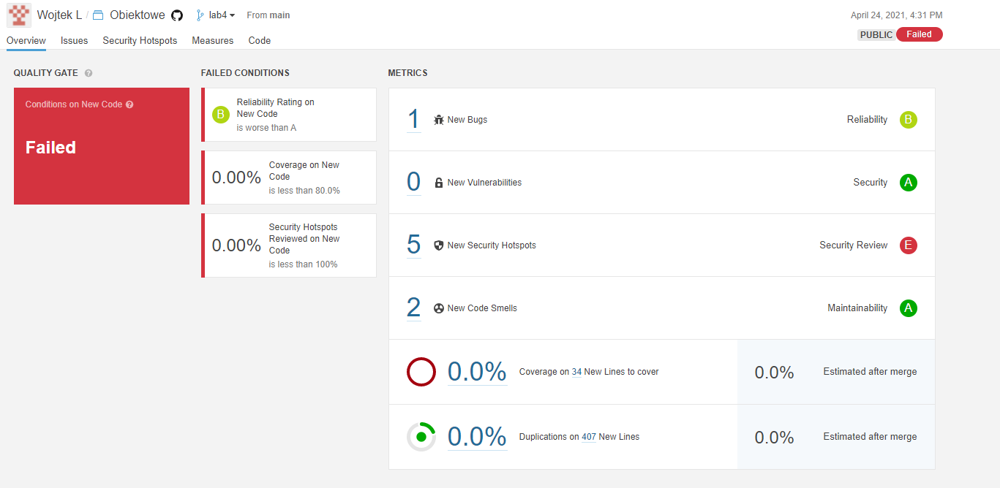
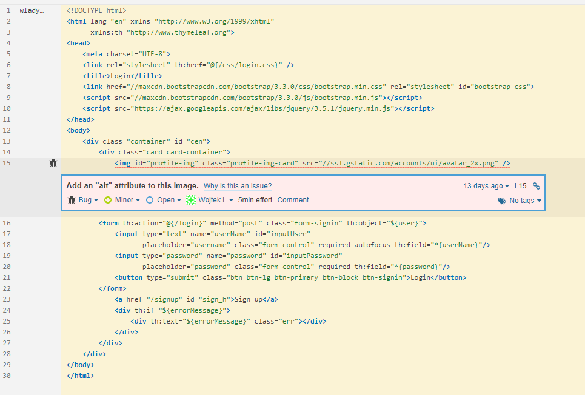
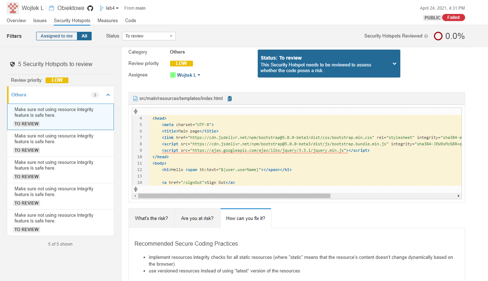

# Kotlin - spring boot

### projekt nie zawiera badge gdyż sonarcloud nie wspiera go dla Short-lived branches

## Piersze skanowanie sonarCloud

### Bugs

### Security

### Code Smells

## Po naprawie

