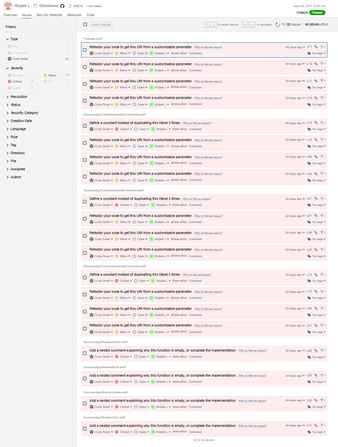

# Vapor - swift

### projekt nie zawiera badge gdyż sonarcloud nie wspiera go dla Short-lived branches

---------------------------------------------------------
### run migrations __vapor run migrate__
### run app __vapor run serve --hostname 0.0.0.0__

### endpoints
- [books](http://localhost:8080/books)   
- [authors](http://localhost:8080/authors)   
- [libraries](http://localhost:8080/libraries)   

## Piersze skanowanie sonarCloud

### Code Smells

## Po naprawie

