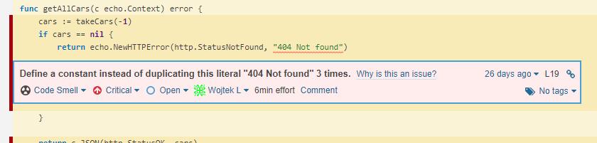
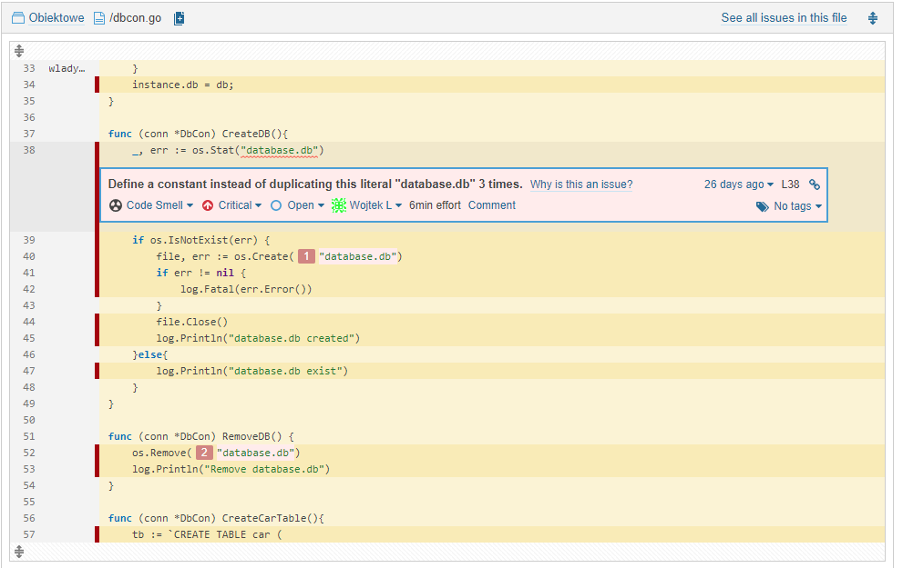

# Obiektowe

### run -> __go run *.go__

## GET
```http://localhost:1234/cars```  
response  
```
[
    {
        "id": 2,
        "mark": "Kaczka2",
        "name": "Kuna",
        "moc": 120
    },
    {
        "id": 3,
        "mark": "Ferrari",
        "name": "Dino",
        "moc": 345
    },
    {
        "id": 4,
        "mark": "Ford",
        "name": "Kuna",
        "moc": 120
    },
    ...
]
```
```http://localhost:1234/cars/3```   
response   
```
{
    "id": 3,
    "mark": "Ferrari",
    "name": "Dino",
    "moc": 345
}
```

### PUT
```http://localhost:1234/cars/2?what=mark&nowy=Kaczka2```   
before      
```
{
    "id": 2,
    "mark": "Kaczka",
    "name": "Kuna",
    "moc": 120
}
```    
response   
```
{
    "id": 2,
    "mark": "Kaczka2",
    "name": "Kuna",
    "moc": 120
}
```
### POST
```http://localhost:1234/cars?mark=Alfa Nowa&name=Julia&moc=450```  
response   
```
{
    "id": 41,
    "mark": "Alfa Nowa",
    "name": "Julia",
    "moc": 450
}
```

### DELETE  
```http://localhost:1234/cars/41```  
 response  
```
{
    "id": 41,
    "mark": "Alfa Nowa",
    "name": "Julia",
    "moc": 450
}
```

### projekt nie zawiera badge gdyż sonarcloud nie wspiera go dla Short-lived branches

## Piersze skanowanie sonarCloud


### Code Smells




## Po naprawie
